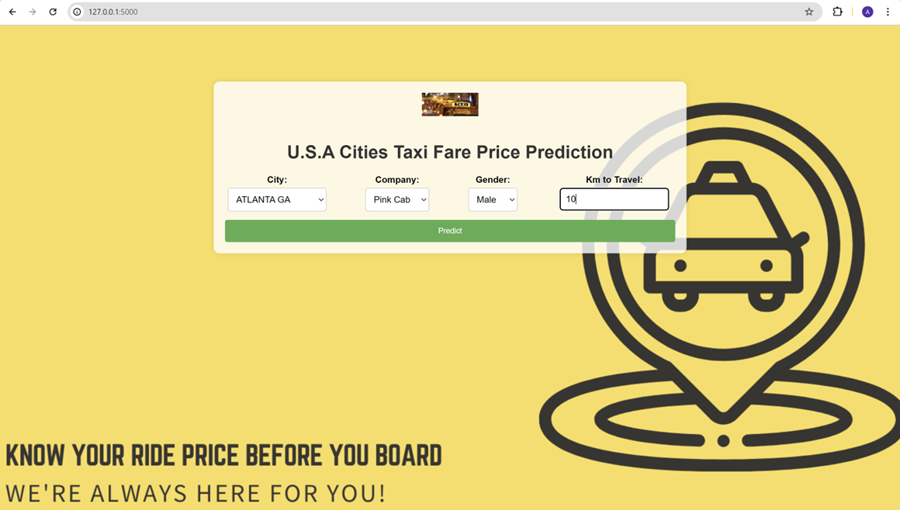
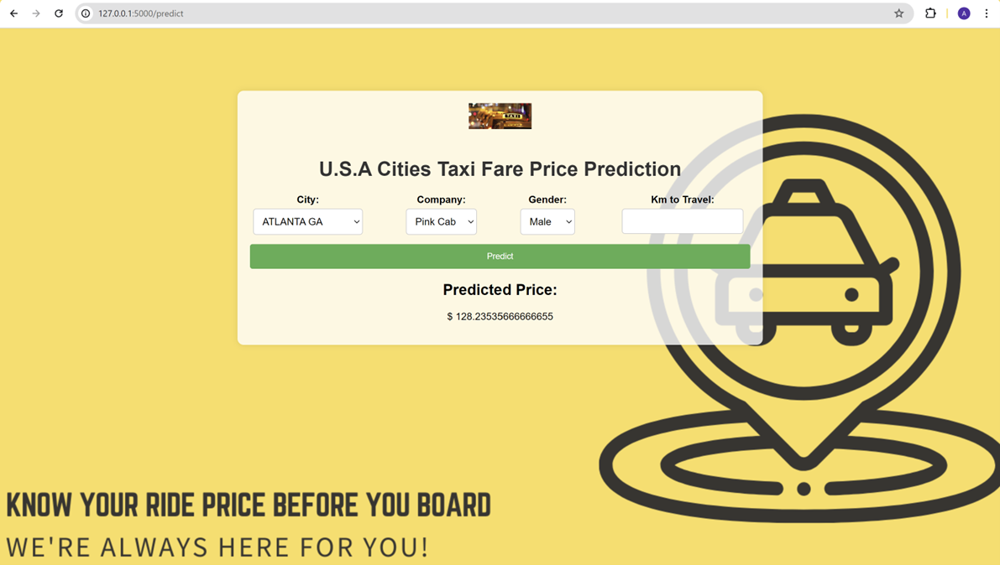

#Cab Price Prediction Flask Web App

Welcome to the Cab Price Prediction Flask Web App repository! This repository contains code for a web application built with Flask that predicts the price of a cab ride based on certain features. You can use this README file as a guide to fork and deploy the web app for your own use.

---
# **Usage Instructions:**

Follow these steps to deploy the Cab Price Prediction Flask Web App

**1. Clone the Repository:**

    ``git clone https://github.com/BigDataEngineer09/Cab-Price-Prediction.git``

**2. Navigate to the Directory:**

    ``cd Cab-Price-Prediction``

**3. Install Dependencies:**

    ``pip install -r requirements.txt``

**4. Run the Application in CMD or VSC:**

    ``python app.py``

     This will start the Flask server **locally**.

**5. Access the Web App:**

     Open your web browser and go to http://127.0.0.1:5000/ to access the Cab Price Prediction web app.

**6. Input Data and Get Predictions:**

    Fill in the required information about the cab ride (e.g., distance, time) and click on the "Predict" button to get the predicted price.

# **Cloud Deployment Instructions:**

Follow the given steps to deploy the Cab Price Prediction Flask Web App on **Microsoft Azure** cloud using the below guide.

[PDF file](https://github.com/BigDataEngineer09/Cab-Price-Prediction/blob/main/Docker_Deployment_Azure_Procedure.pdf)

---
# **Contributing:**
If you'd like to contribute to this project, feel free to fork the repository, make your changes, and submit a pull request. Contributions are welcome!

---
Feel free to reach out if you have any questions or need further assistance!

Happy coding! 🚕💻
